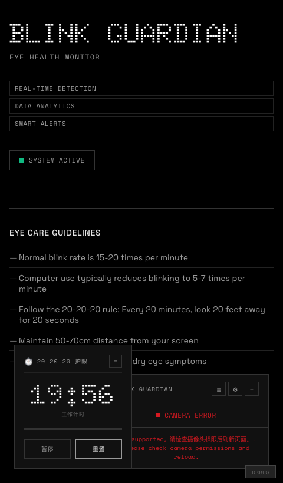
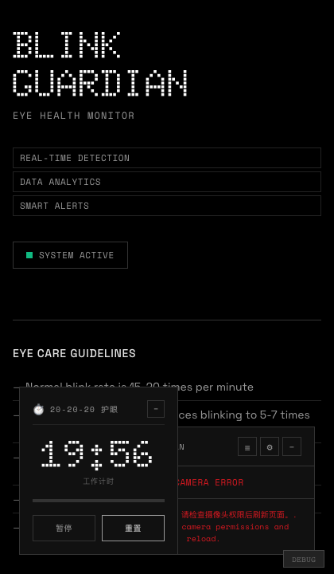
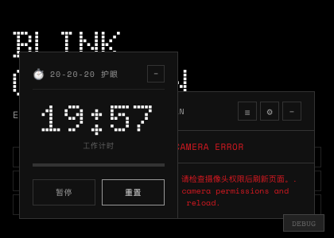
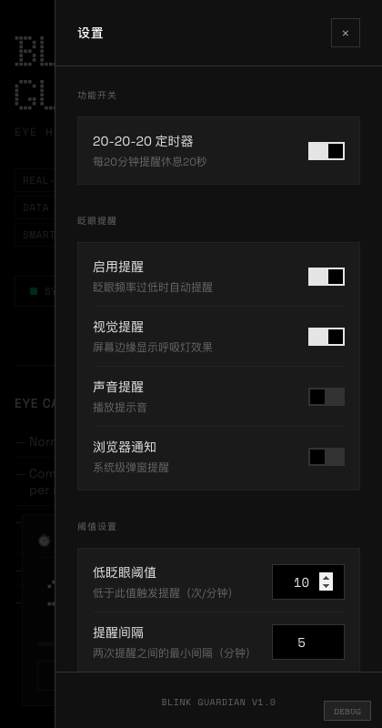
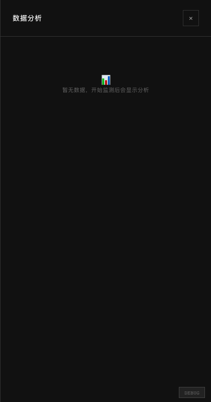

<p align="center">
  
</p>

<h1 align="center">BLINK GUARDIAN</h1>

<p align="center">
  <strong>Real-time Eye Blink Monitor</strong> — 用摄像头追踪你的眨眼频率，守护用眼健康
</p>

<p align="center">
  <a href="#-features">功能特性</a> •
  <a href="#-quick-start">快速开始</a> •
  <a href="#-usage">使用指南</a> •
  <a href="#-tech-stack">技术架构</a>
</p>

---

## ✨ 为什么需要它

长时间面对屏幕会让人的眨眼频率从正常的 **15-20 次/分钟** 骤降到 **5-7 次/分钟**，导致眼干、疲劳甚至视力损伤。

Blink Guardian 通过浏览器调用摄像头，**实时检测眨眼行为**，当你的眨眼率低于健康阈值时发出提醒，帮你养成健康的用眼习惯。

---

## 🎯 核心功能

### 实时监测面板

主面板以极简的暗色界面展示所有关键指标：

<p align="center">
  
</p>

- **BPM 大数字**：实时眨眼频率（次/分钟），颜色随健康状态变化（绿色正常 → 橙色警告 → 红色危险）
- **分段进度条**：12 段式可视化当前速率与阈值的距离
- **状态指示器**：NORMAL / WARNING / DANGER 三级状态
- **累计统计**：TOTAL 眨眼次数 + ELAPSED 监测时长
- **眼睛状态图标**：实时显示睁眼/闭眼状态 + EAR（Eye Aspect Ratio）数值

### 最小化模式

点击 `−` 按钮收起到紧凑条，保持后台运行不占空间：

<p align="center">
  
</p>

### 智能提醒系统

三级阈值触发机制：

| 级别 | 条件 | 行为 |
|------|------|------|
| 🟢 Normal | BPM ≥ 阈值 | 一切正常 |
| 🟡 Warning | 阈值的 50% ≤ BPM < 阈值 | 视觉提示 + 屏幕边缘闪烁 |
| 🔴 Danger | BPM < 阈值的 50% | 强制弹窗 + 声音报警 |

支持四种提醒方式（可在设置中独立开关）：
- **视觉提醒** — 屏幕边缘呼吸灯效果
- **声音提醒** — 浏览器播放提示音
- **浏览器通知** — 系统级桌面通知
- **20-20-20 定时器** — 每 20 分钟自动提醒远眺

### 自定义设置

完整的参数配置面板：

<p align="center">
  
</p>

- **低眨眼阈值**：自定义触发警告的 BPM 下限（默认 10）
- **提醒间隔**：两次提醒之间的最小冷却时间
- **各提醒通道开关**：灵活组合视觉 / 声音 / 通知 / 定时器
- **标定数据管理**：手动设置开眼和闭眼的 EAR 基准值

### 数据分析

历史监测数据查看与趋势分析：

<p align="center">
  
</p>

每次监测会话自动记录：
- 平均眨眼频率
- 总眨眼次数
- 监测时长

### 🌐 全局模式 (Picture-in-Picture)

点击 `⬚` 按钮，将监测窗口变为 **PiP 浮窗**，置顶于所有窗口之上。即使切换到其他应用或浏览器标签页，眨眼监测也不会中断——PiP 窗口持续运行检测，数据实时回传到主页面。

---

## 🚀 Quick Start

```bash
# 克隆仓库
git clone https://github.com/drrreistein/blink_guardian.git
cd blink_guardian

# 安装依赖
npm install

# 启动开发服务器
npm run dev

# 构建生产版本
npm run build
# 构建产物在 dist/ 目录
```

启动后打开浏览器访问 `http://localhost:5174`，允许摄像头权限即可开始使用。

> **注意**：需要 HTTPS 或 localhost 环境才能调用摄像头。`npm run dev` 已自动处理。

## 📖 使用流程

1. **打开页面** → 浏览器会请求摄像头权限，点击「允许」
2. **自动开始检测** → 调整面部位置，让眼睛处于画面中
3. **观察数据** → 主面板实时显示 BPM、累计次数等数据
4. **接收提醒** → 当眨眼率过低时，按配置的方式收到提醒
5. **查看历史** → 点击 ≡ 图标打开数据分析面板
6. **调整参数** → 点击 ⚙ 图标打开设置面板自定义阈值

## 🏗 技术栈

| 层级 | 技术 |
|------|------|
| **框架** | React 19 + TypeScript |
| **构建** | Vite |
| **样式** | CSS Modules (纯手写暗色主题) |
| **检测** | MediaPipe Face Mesh (WASM，浏览器端运行) |
| **算法** | EAR (Eye Aspect Ratio) 眨眼检测 + 滑动窗口去抖 |
| **存储** | localStorage (设置 + 标定数据 + 历史会话) |
| **全局模式** | Picture-in-Picture API + postMessage 跨窗口通信 |

### 核心检测原理

```
摄像头帧 → MediaPipe Face Mesh (468 个面部关键点)
         → 提取左右眼各 6 个关键点
         → 计算 EAR (Eye Aspect Ratio) 值
         → 滑动窗口平滑 + 阈值判断
         → 输出: isBlinking / blinkRate / blinkCount
```

## 📁 项目结构

```
src/
├── components/
│   ├── MonitorWidget.tsx       # 主监控面板（核心 UI）
│   ├── SettingsPanel.tsx       # 设置面板
│   ├── AnalyticsPanel.tsx      # 数据分析面板
│   ├── SegmentedBar.tsx        # 分段进度条组件
│   ├── Timer202020.tsx         # 20-20-20 定时器
│   └── App.tsx                 # 应用入口 + PiP 文档
├── hooks/
│   ├── useBlinkDetector.ts     # 眨眼检测核心 hook（MediaPipe + EAR）
│   ├── useGlobalMode.ts        # 全局模式 / PiP 管理
│   ├── useAlert.ts             # 提醒逻辑（三级阈值）
│   └── useSessionStorage.ts    # 会话数据持久化
└── utils/
    ├── eyeGeometry.ts          # EAR 计算几何工具
    └── calibration.ts          # 标定工具
```

## ⚙️ 可用脚本

| 命令 | 说明 |
|------|------|
| `npm run dev` | 启动开发服务器 (Vite) |
| `npm run build` | 构建生产版本到 `dist/` |
| `npm run preview` | 本地预览构建产物 |

## 📄 License

MIT License © 2026 drrreistein
